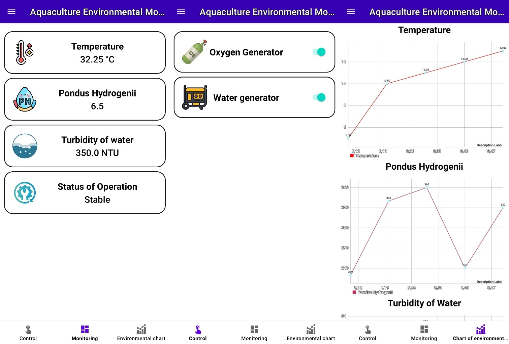

<h1 align="center">Welcome to my AEMS System WEB and App 👋</h1>

> Building a web application to collect and monitor indicators of the aquaculture environment. It also cans control some water and oxygen pumps

### ✨ [Demo web pictures]
> [!NOTE]
> This is dashboard UI

> [!NOTE]
> This is control UI

### ✨ [Demo App pictures]
